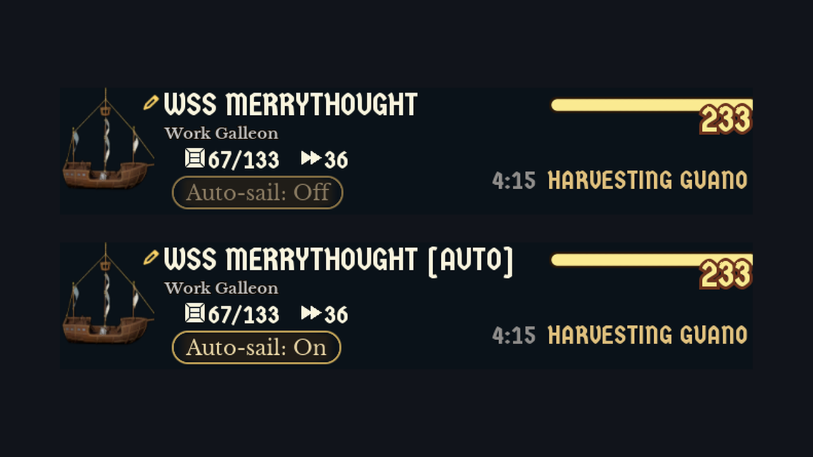

# SetSail

A quality-of-life mod for [Whiskerwood](https://store.steampowered.com/app/2489330/Whiskerwood/).

> **Version 0.1 – beta.** It works in my own town, but it hasn't been tested widely yet. Please report anything odd.

Fishing, trade and guano ships wait at their dock until you open the dock window and click **Send to sea**. SetSail adds an **Auto-sail** toggle to those dock windows. Switch it on and that dock's ship leaves by itself whenever it's ready: repaired, crewed and supplied.

## How to use it

1. Open a **Deep Sea Fishing Dock**, **Trade Ship Dock** or **Guano Collection Dock**.
2. Under the ship's name you'll find **Auto-sail: Off**. Click it to switch it **On**.
3. That's it. From now on the ship sails by itself whenever it is ready. It goes where the dock would send it anyway: fishing at the nearest stocked fishing grounds, trading with the chosen partner, harvesting guano.

Auto-sail is **off for every dock until you switch it on**, so nothing changes in your town until you choose so.

### Why does the ship's name change?

When you switch Auto-sail on, the ship gets an **`[auto]`** tag at the end of its name, for example *WSS Merrythought [auto]*. Switching it off removes the tag again.

Mods can't store their own data in a save file, but the game does save ship names. The tag is how SetSail remembers which docks are on auto-sail, separately for every save. It also means:

- You can see at a glance which ships are on auto-sail.
- You can type `[auto]` into a ship's name yourself (pencil icon next to the name). It works the same as the toggle. Capitals don't matter.
- If you remove the mod, the tag stays in the name until you delete it. The ship just won't sail by itself any more.

### When do ships leave?

SetSail doesn't watch the docks every moment. The game doesn't tell mods when a crew has boarded, and constant checking would cost performance in big towns. Instead it checks **six times per in-game day**, spread over the daytime:

- at **dawn** (day start), and when a save finishes loading,
- **four more times** during the day,
- **one last time just before evening**,
- and whenever a sea notice comes in (for example *trade ready*).

At each check, every auto-sail ship that the game would let you send right now is sent. At night nothing is sent: the whiskers are asleep.

So a ship can wait in port for a short while before it leaves (at most until the next check, a fraction of a day). A ship that's still missing crew, supplies or repairs simply waits for a later check, the same way the **Send to sea** button stays greyed out.

## Features

- **Per-dock Auto-sail toggle** in the dock window, off by default.
- **Fishing, trade and guano docks.** Docks you build later get the toggle too.
- **Uses the game's own Send to sea command**, so the ship takes the dock's normal goal and the game's own departure checks (crew, supplies, approval) apply.
- **Saved per save game** through the ship name (see above).
- **Light on performance:** six checks per day, looking only at fishing, trade and guano docks, never at all buildings.

## Installing

- **Steam Workshop:** subscribe. That's all.
- **Manually:** put `SetSail.pak` and `SetSail.uplugin` in
  `%localappdata%\Whiskerwood\Saved\mods\SetSail\` (create the folder; the file names must stay `SetSail.*`).

## Known limitations

- **Beta:** tested in one town on game version 0.7.207 (UE 5.8).
- Ships are only sent at the six daily checks, not the moment they're ready.
- The toggle appears when you open a dock window by clicking the dock, or when you use a button inside the window (dock arrows, tabs). If it ever shows the wrong state, click the dock again.
- Other dock types (scouting, hunting, naval combat, storage piers) aren't handled.

## Version history

- **0.1** – first beta: Auto-sail toggle for fishing, trade and guano docks, six checks per in-game day.

## Debug logging

The mod logs nothing by default. To see what it does, create
`%localappdata%\Whiskerwood\Saved\mods\SetSailConfig\debug.txt` containing any text (e.g. `1`; an empty file counts as off).
It is read when a save finishes loading; log lines go to `%localappdata%\Whiskerwood\Saved\Logs\modlog.txt`.
(The mod API's `ReadModTextFile` adds `.txt` to the name it is given, so the mod asks for `debug`.)
The Workshop upload never contains the Config folder, so published copies stay silent.

## For modders

### Repository layout

| Path | What |
|---|---|
| `Mod/SetSail/` | The mod's source assets (`.uasset`) and `SetSail.uplugin`. This is the whole mod. |
| `docs/graphs/` | Blueprint graphs as copy-paste text (T3D). Reference only: the `.uasset` files are the source of truth. |
| `tools/` | `t3d.py` + `setsail_build.py`: Python generator that writes the graphs in `docs/graphs/` from the modkit's reflection dump. |
| `workshop/` | SteamCMD item file (`SetSail.vdf`) and [upload steps](workshop/HOW_TO_UPLOAD.md). The preview image is `docs/screenshot.png`. |
| `sync-from-modkit.bat` | Copies the mod's assets from the modkit into this repo and stages the built `.pak` + uplugin into `workshop/content/`. |
| `sync-to-steam.bat` | Uploads `workshop/content/` to the Workshop with SteamCMD. |

### Building from source

1. Set up the official [Whiskerwood modkit](https://github.com/Whiskerwood-Modding/Whiskerwood-Project) (custom UE 5.8 build).
2. Copy `Mod/SetSail/` from this repo to `Content/Mods/SetSail/` in the modkit project.
3. Right-click the `SetSail` folder → **Cook & Install** (Mod Tools). The mod uses pak chunk 26 (`PAL_SetSail`).
4. After editing in the editor, run `sync-from-modkit.bat` to copy the changed assets back into `Mod/SetSail/`, then commit.
   The script assumes the modkit is at `E:\modding\Whiskerwood-Project`; override with `set MODKIT=D:\other\path` first.

Assets:

- `BP_MapLoad`: **Actor** Blueprint, all the logic. There is no BP_Startup and no Mods-menu option.
- `WBP_SailToggle`: Widget Blueprint, designer only. A **CheckBox `Check`** (Is Variable, Check Box Type *Toggle Button*, rounded-box "pill" brushes with a gold outline) holding a **TextBlock `Label`** (Is Variable, Libre Baskerville). The mod sets the label to "Auto-sail: On/Off" in cream `E9D7A6` / dim `8C7D63`.
- `WBP_SailWaiter`: Widget Blueprint, empty designer, variables `Waited` (Float) and `FirstSent` (Boolean), **Event Dispatcher `Done`** (no inputs). BP_MapLoad binds `Done` to its OnClickCheck, so there's no "Owner" variable typed as BP_MapLoad (every mod has one, and the type picker can't tell them apart).
- `PAL_SetSail`: Primary Asset Label, Chunk ID 26, *Label Assets In My Directory* on, Cook Rule *Always Cook*.

`python tools/setsail_build.py` writes the paste text into `tools/out/` (copies in `docs/graphs/`). It needs the modkit's `Content/DynamicClasses/Whiskerwood-*.jmap.gz`; set `JMAP=...` if it isn't next to this repo. In the asset's event graph: Ctrl+A, Delete, Ctrl+V, then compile. Paste the waiter before BP_MapLoad.

`BP_MapLoad` variables (create them before pasting):

| Variable | Type |
|---|---|
| `Debug` | Boolean |
| `View` | UI_WorkDockView, object reference |
| `Docks` | Actor, object reference, **array** |
| `DockOpt` | String, **array** |
| `DockClasses` | Actor, **class** reference, **array** |
| `DockKinds` | String, **array** |
| `Tries` | Integer |
| `RetryPending` | Boolean |
| `Toggle` | WBP_SailToggle, object reference |
| `Waiter` | WBP_SailWaiter, object reference |
| `Win` | User Widget, object reference |
| `Injected` | User Widget, object reference |
| `Anchor` | Widget, object reference |
| `Target` | Panel Widget, object reference (**not** an array) |

If a red event wire (OnLoaded, OnDayStart, OnNotice, OnNoticeCleared, OnRetry, OnToggle, OnWindowButton, OnClickCheck → its *Bind Event* node) pastes unconnected, drag it again.

### How it works

- **Docks:** fishing, trade and guano docks are the GridActors `navaldock_fishing_C` / `navaldock_trade_C` / `navaldock_guano_C` (building table `GridActors`, rows `navalfishingdock` / `navaltradeDock` / `navalGuanoDock`). At load the mod lists only these classes (`GetAllActorsOfClass` per class).
- **Reading a dock:** one invisible `UI_WorkDockView` (the dock window class) is pointed at a dock with `SetObjectPropertyByName(View, "Context", dock)`; `CalcHudState()` returns `WorkDock_UIData` with `workDockPhase` (5 = ready to deploy), `allowDeparture`, the ship's name and id.
- **Sending:** phase 5, departure allowed and `[auto]` in the ship name → `PlayerController_Play.HandleHudAction` with action `dispatchShipFromDock` and `paramGrid` = the dock's root cell. The game's handler looks up the building on that cell and sends its ship (the same code the Send to sea button ends up in; the button's own action carries no cell).
- **Schedule:** at day start and on load, six checks are planned: one now, five more spread evenly until night, the last about 10 game seconds before night. Before each check the mod asks `WorldTime.TimeUntilNextPhase` (game seconds until night, the same units as timers), so the spacing follows the game speed. One-shot timers only, no tick; nothing at night. Sea notices (`NauticalOcean.OnNoticeChange / OnNoticeClear`) trigger an extra check.
- **Toggle:** a left click in the world (or a click on a button inside the dock window) shows the invisible `WBP_SailWaiter`. Its Tick (UI ticks even when paused) calls `Done` on its first frame and again after 0.15 s, then removes itself. OnClickCheck finds the visible dock window, adds `WBP_SailToggle` as a new row of the nearest VerticalBox above the window's rename button `ButtonEditName`, binds the window's own buttons, and sets the toggle from the ship's name. The toggle is hidden for dock types SetSail doesn't handle (recognised by class, so docks built after loading work and are added to the check list).
- **Renaming:** `HandleHudAction("setNauticalShipName")` with `paramString` = new name and `paramName` = the ship's id (`assignedShipInfo.nameId`). Switching on appends ` [auto]`; switching off removes ` [auto]` / `[auto]` (and the old `[hold]` tag from development builds).

## Credits

Created by rinku using the Whiskerwood modkit: https://github.com/Whiskerwood-Modding/Whiskerwood-Project
